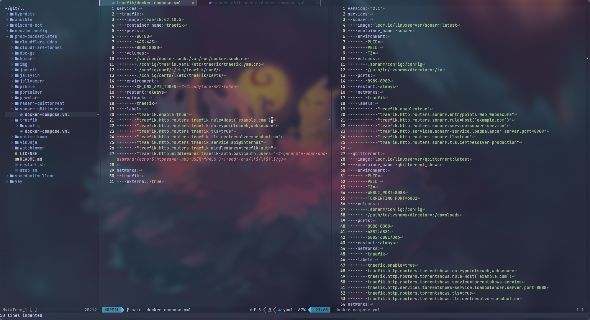
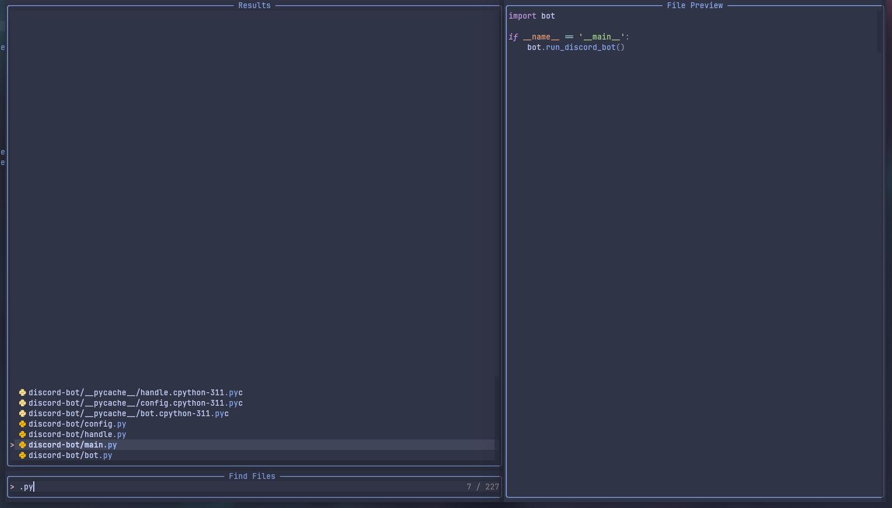
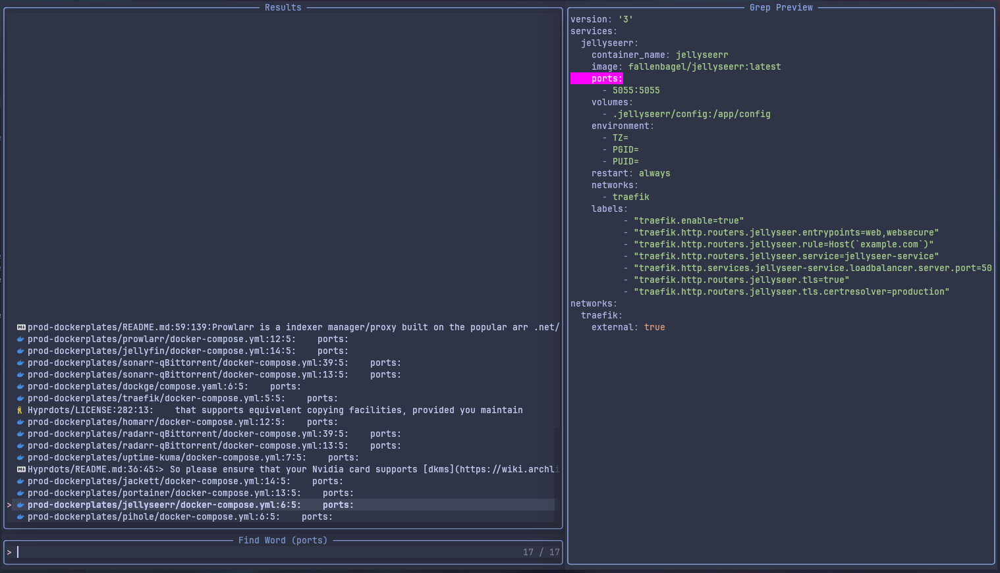
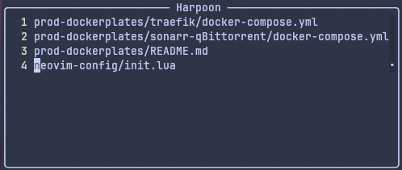
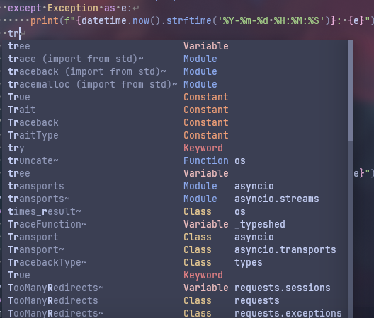
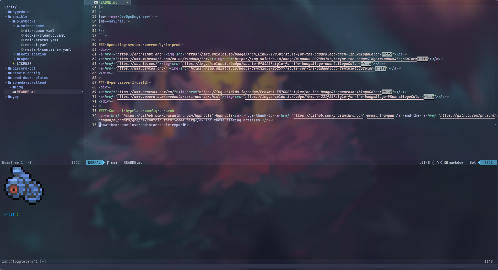

# Neovide to LSP

> [!WARNING]
> If you read this keep in mind that this config is tailored for my needs with plugins and shortcuts. Also I use `Neovide` not Neovim for the animated cursor so Neovim is broken with this config.

## Important cp

Install Neovim & Neovide.

```
sudo pacman -S neovim neovide
```

Clone repo and copy dotfiles to ~/.config/neovide

```
git clone https://github.com/hussaratkuro/init.lua.git
cd init.lua
mkdir -p ~/.config/neovide
cp -r * ~/.config/neovide
```

Set environment variables for config location.

```
export XDG_CONFIG_HOME=~/.config/
export XDG_CONFIG=~/.config/
```

Install packer plugin manager.

```
git clone --depth 1 https://github.com/wbthomason/packer.nvim\
 ~/.local/share/nvim/site/pack/packer/start/packer.nvim
```

> Put this in .zshrc if you will

```
alias vim='neovide'
```

## Plugins

### Plugin manager

- [wbthomason/packer.nvim](https://github.com/wbthomason/packer.nvim)

### Fuzzy funder

- [nvim-telescope/telescope.nvim](https://github.com/nvim-telescope/telescope.nvim)

### File tree / tabs

- [nvim-tree/nvim-tree.lua](https://github.com/nvim-tree/nvim-tree.lua)
- [romgrk/barbar.nvim](https://github.com/romgrk/barbar.nvim)

### Terminal

- [akinsho/toggleterm.nvim](https://github.com/akinsho/toggleterm.nvim)

### Theme (mocha) / colors

- [catppuccin/nvim](https://github.com/catppuccin/nvim)
- [brenoprata10/nvim-highlight-colors](https://github.com/brenoprata10/nvim-highlight-colors)
- [uga-rosa/ccc.nvim](https://github.com/uga-rosa/ccc.nvim)

### Status line

- [nvim-lualine/lualine.nvim](https://github.com/nvim-lualine/lualine.nvim)

### Scrolling (search and git options too)

- [petertriho/nvim-scrollbar](https://github.com/petertriho/nvim-scrollbar)
- [kevinhwang91/nvim-hlslens](https://github.com/kevinhwang91/nvim-hlslens)
- [lewis6991/gitsigns.nvim](https://github.com/lewis6991/gitsigns.nvim)
- [karb94/neoscroll.nvim](https://github.com/karb94/neoscroll.nvim)

### Syntax

- [nvim-treesitter/nvim-treesitter](https://github.com/nvim-treesitter/nvim-treesitter)
- [nvim-treesitter/playground](https://github.com/nvim-treesitter/playground)

### Editing support

- [windwp/nvim-autopairs](https://github.com/windwp/nvim-autopairs)
- [windwp/nvim-ts-autotag](https://github.com/windwp/nvim-ts-autotag)
- [mbbill/undotree](https://github.com/mbbill/undotree)
- [mg979/vim-visual-multi](https://github.com/mg979/vim-visual-multi)
- [numToStr/Comment.nvim](https://github.com/numToStr/Comment.nvim)

### Marks

- [theprimeagen/harpoon](https://github.com/theprimeagen/harpoon)

### LSP

- [VonHeikemen/lsp-zero.nvim](https://github.com/VonHeikemen/lsp-zero.nvim)
- [williamboman/mason.nvim](https://github.com/williamboman/mason.nvim)
- [williamboman/mason-lspconfig.nvim](https://github.com/williamboman/mason-lspconfig.nvim)
- [neovim/nvim-lspconfig](https://github.com/neovim/nvim-lspconfig)
- [hrsh7th/nvim-cmp](https://github.com/hrsh7th/nvim-cmp)
- [hrsh7th/cmp-nvim-lsp](https://github.com/hrsh7th/cmp-nvim-lsp)
- [L3MON4D3/LuaSnip](https://github.com/L3MON4D3/LuaSnip)

### Notifications

- [folke/noice.nvim](https://github.com/folke/noice.nvim)
- [MunifTanjim/nui.nvim](https://github.com/MunifTanjim/nui.nvim)
- [rcarriga/nvim-notify](https://github.com/rcarriga/nvim-notify)

## Showcase

### `Nvim-tree` + `Barbar tabs` and split screen coding capabilities

Toggle the file tree with a shortcut, navigate your directory and start coding, If you want to look up something or write code in multiple files there is a shortcut for splitting the screen horizontally/vertically.



### `Telescope` aka fuzzyfinder

Big projects are a pain in the butt to navigate between files, this plugin is a fuzzyfinder integration for Neovim to go between files faster.



### `Grep string`

Telescope let's you search for a string in all the files inside your opened directory. After the search results you can preview the code part containing the string you searched for before opening a file for editing.



### "`Harpoon` man"

Harpoon is probably the fastest way to navigate files. Save the files you are currently working on in a buffer and switch between them with shortcuts. Insanely fast.



### `Zero LSP`

Install your favorite LSP servers for your languages and enjoy the code autocompletion.



### `Toggle term`

Toggle the terminal window with a shortcut whenever you are in need of a terminal instead of opening an entirely new terminal taking up space on your screen just to close it afterwards.


